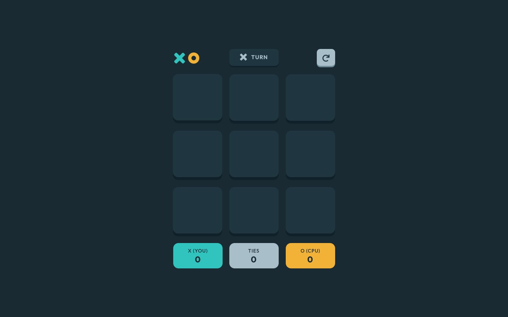
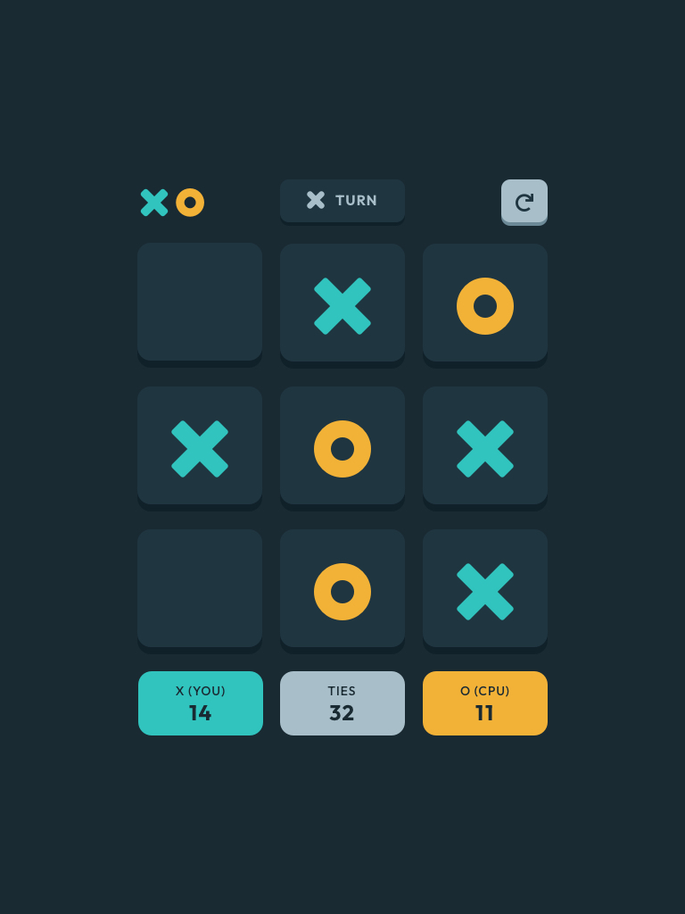
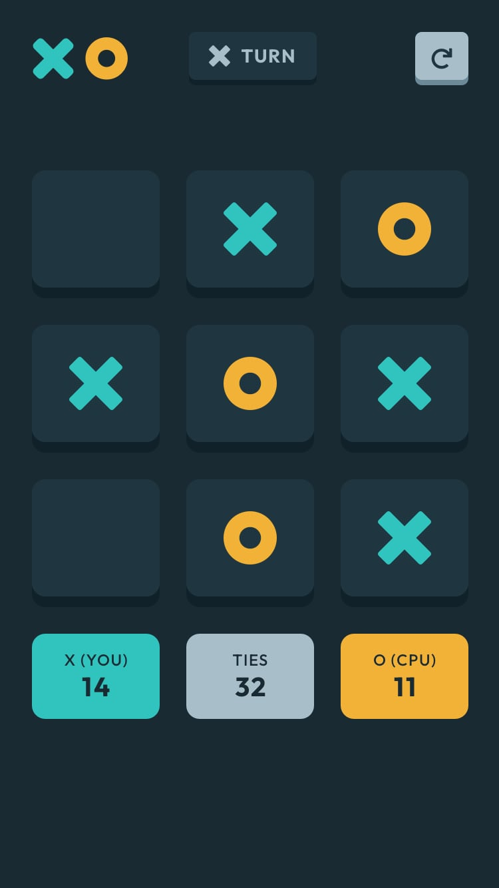
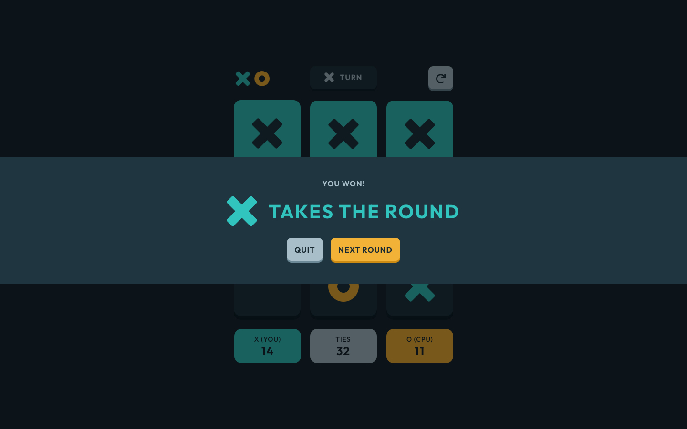

# Tic Tac Toe Game - Front End

Tic Tac Toe Game is code challenges project from Frontend Mentor, you can find the original desing [here](https://www.frontendmentor.io/challenges/tic-tac-toe-game-Re7ZF_E2v).

This is my frist React project. The live version of this project is deployed at vercel, click [here](https://tic-tac-toe-joeyliudev.vercel.app/) to check

## Screenshots

### DeskTop Design

<center>
<figure>
  
</figure>
</center>
### Tablet Design

<center>
<figure>
  
</figure>
</center>
### Mobile Design

<center>
<figure>
  
</figure>
</center>
### Win Design

<center>
<figure>

</figure>
</center>
## Getting Started

These instructions will help you get a copy of the project up and running on your local machine for development and testing purposes.

### Prerequisites

Before you start, you will need to have the following software installed on your machine:

- Node.js (version 12.0.0 or higher)
- npm (version 6.0.0 or higher)

If you don't have [Node.js](https://nodejs.org) and [npm](https://www.npmjs.com/get-npm) installed, you can download them from the official websites.

### Installing

To install the project, follow these steps:

1. Clone the repository
2. Change into the project directory
3. Install the dependencies:

```console
    npm install
```

### Running

To start the development server, run npm run dev in the project directory.

```console
    npm run dev
```

This will start the server and open the app in your default web browser at http://localhost:5173/.

This will create an optimized build in the 'build' directory.

## Built With

- HTML
- CSS
- TypeScript
- React.js - The JavaScript library used to build the user interface

## Disclaimer

This project is solely for demonstration purposes, and not intended for commercial use.
